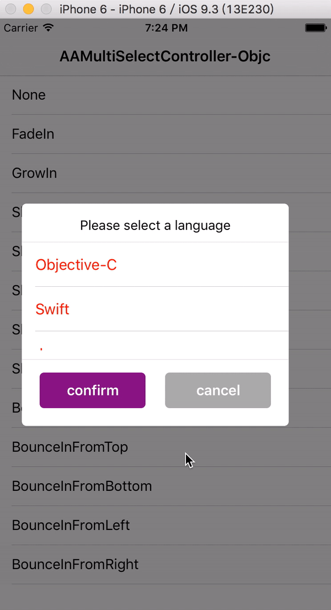

# AAMultiSelectController


[](https://travis-ci.org/dev-aozhimin/AAMultiSelectController)
[](http://cocoapods.org/pods/AAMultiSelectController)
[](http://cocoapods.org/pods/AAMultiSelectController)
[](http://cocoapods.org/pods/AAMultiSelectController)

# Overview
AAMultiSelectController provides a popup dialog which user can multi-select.it's easy to use and integrate in your project.

## Sample project
We provided two sample projects, one is written in Objective-C, the other is written in Swift. After you clone the repo, to run the Objective-C one, select the scheme called `AAMultiSelectController-Objc` in XCode. Similarly, to run the Swift one, select the scheme called `AAMultiSelectController-Swift` in XCode



## Requirements
AAMultiSelectController works on iOS 8.0+ and requires ARC to build.


## Installation

AAMultiSelectController is available through [CocoaPods](http://cocoapods.org). To install
it, simply add the following line to your Podfile:

```ruby
pod "AAMultiSelectController"
```

and edit pod file, install `AAMultiSelectController` into your project just excute command as follow:

```ruby
pod install
```

## Using in a Swift Project

Install `AAMultiSelectController` using CocoaPods. If it's built as a dynamic framework, then add `@import AAMultiSelectController ` into the bridging header for your Swift project. 
Otherwise, `#import <AAMultiSelectController/AAMultiSelectController.h>` 

## Usage
(see the usage which I put in the sample project)

### Objective-C

```objective-c
@property (nonatomic, strong) AAMultiSelectViewController *multiSelectVC;


self.multiSelectVC = [[AAMultiSelectViewController alloc] init];    
self.multiSelectVC.titleText = @"选择语言";
self.multiSelectVC.view.frame = CGRectMake(0, 0,
                                               CGRectGetWidth(self.view.frame) * multiSelectViewWidthRatio,
                                               multiSelectViewHeight);
self.multiSelectVC.itemTitleColor = [UIColor redColor];
self.multiSelectVC.dataArray = [self.dataArray copy];
[self.multiSelectVC setConfirmBlock:^(NSArray *selectedObjects) {
        NSMutableString *message = [NSMutableString stringWithString:@"您选中了:"];
        [selectedObjects enumerateObjectsUsingBlock:^(AAMultiSelectModel * _Nonnull object, NSUInteger idx, BOOL * _Nonnull stop) {
            [message appendFormat:@"%@,", object.title];
        }];
        UIAlertView *alertView = [[UIAlertView alloc] initWithTitle:nil
                                                            message:[message copy]
                                                           delegate:nil
                                                  cancelButtonTitle:nil
                                                  otherButtonTitles:@"确定", nil];
        [alertView show];
    }];
self.multiSelectVC.popupShowType = indexPath.row;
self.multiSelectVC.popupDismissType = indexPath.row;
[self.multiSelectVC show];
```

### Swift

```swift
    private lazy var multiSelectVC: AAMultiSelectViewController = {
        var vc = AAMultiSelectViewController.init()
        vc.titleText = "Please select a language"
        vc.view.frame = CGRectMake(0, 0,
                                   CGRectGetWidth(self.view.frame) * kMultiSelectViewWidthRatio,
                                   kMultiSelectViewHeight)
        vc.itemTitleColor = UIColor.redColor()
        vc.dataArray = self.dataArray
        vc.confirmBlock = { selectedObjects in
            var message = "You chose:"
            for obj in selectedObjects as! [AAMultiSelectModel] {
                message += "\(obj.title),"
            }
            let alertView: UIAlertView = UIAlertView.init(title: "", message: message, delegate: nil, cancelButtonTitle: "cancel", otherButtonTitles: "confirm")
            alertView.show()
        }
        return vc
    }()
    
    public func tableView(tableView: UITableView, didSelectRowAtIndexPath indexPath: NSIndexPath) {
        tableView.deselectRowAtIndexPath(indexPath, animated: true)
        self.multiSelectVC.popupShowType = AAPopupViewShowType(rawValue: indexPath.row)!
        self.multiSelectVC.popupDismissType = AAPopupViewDismissType(rawValue: indexPath.row)!
        self.multiSelectVC.show()
    }

```


## Author
|Author|Gmail|Twitter|
|:---:|:----:|:----:|
|Alex Ao|aozhimin0811@gmail.com|[@Alex Ao](https://twitter.com/aozhimin0811)|

## License

AAMultiSelectController is available under the MIT license. See the LICENSE file for more info.
